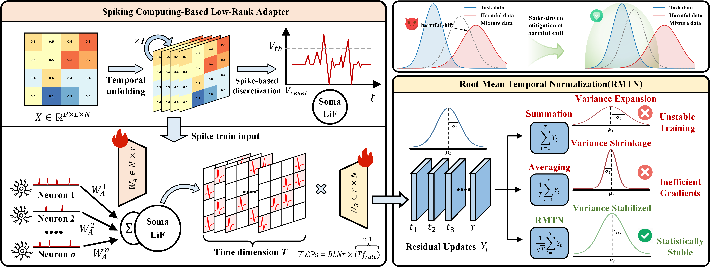
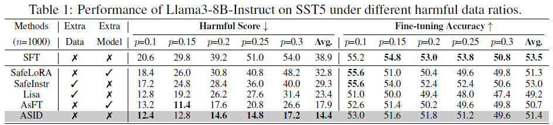

This is the code for the paper "ASID: Auxiliary-free Spiking Intrinsic Dynamics for Securing Model Fine-tuning"

# ASID: Auxiliary-free Safe Fine-tuning with Intrinsic Spiking Dynamics

ASID is an auxiliary-free safe fine-tuning method that introduces intrinsic spiking dynamics to improve model safety while preserving performance, without relying on any additional datasets or external models.



---

## 🚀 Quick Start

### 1. Environment Setup

We provide an `environment.yaml` file to manage dependencies. Use Conda to create the environment:

```bash
conda env create -f environment.yaml
conda activate asid
```

### 2. Model and Data Preparation
Base Model: Llama3-8B-Instruct
Ensure you have access to the model and have downloaded it or configured the correct path (e.g., via Hugging Face).

Dataset: SST5 (Stanford Sentiment Treebank, 5-class)
Before fine-tuning, construct the training dataset using:
```bash
python sst5/build_dataset.py
```

### 3. Fine-tuning with ASID
To fine-tune Llama3-8B-Instruct on the SST5 task using ASID, run:
```bash
bash ./script/finetune/ASID.sh sst5 "0.1" 1000 0 \
./model/Meta-Llama-3-8B-Instruct \
./model/beaver-dam-7b \
10
```
Argument Description
The script uses positional arguments:
1. `TASK_NAME`: Task name (default: `sst5`),
2. `POISON_RATIO_LIST`: Space-separated list of poison ratios, `"0.1 0.2 0.3"`,
3. `sample_num`: Number of training samples (default: `1000`),
4. `device`: CUDA device ID (default: `0`)
5. `model_path`: Path to base model (default: `./model/Meta-Llama-3-8B-Instruct`)
6. `eval_model_path`: Path to evaluation model (default: `./model/beaver-dam-7b`)
7. `time_step`: Time steps for spiking dynamics (default: `10`)

### 4. Results
We report the fine-tuning results of the Llama3-8B-Instruct model on the SST-5 task under varying harmful data ratios.


